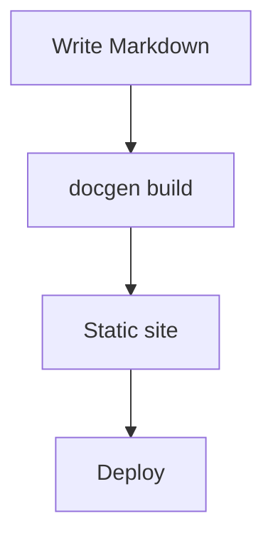
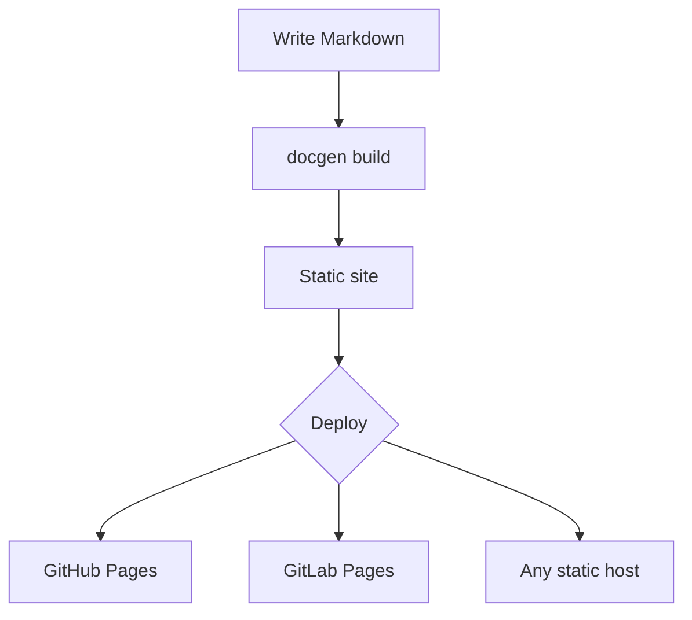
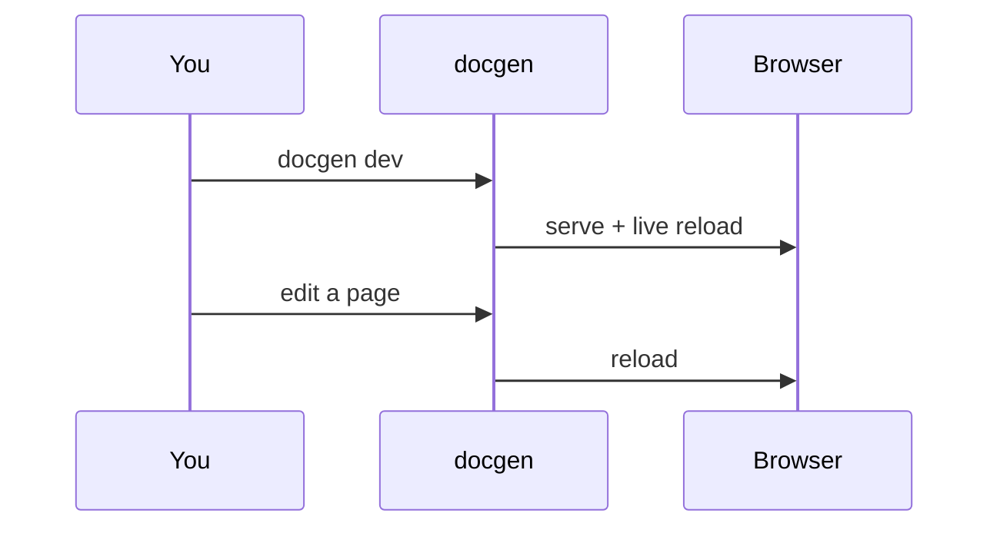

# Math & diagrams

docgen renders **LaTeX math** and **mermaid diagrams** at build time, so readers
get typeset formulas and drawn diagrams without your site shipping a heavy
client-side rendering pipeline. Both are on by default; toggle them in
[[configuration]] under `[features]`.

## Math

**What it is.** LaTeX math typeset with KaTeX during the build.

**Why you'd want it.** Technical docs often need real notation. Because docgen
typesets at build time, the math is fast to load and renders identically for
every reader.

### Syntax

```markdown
Inline math with single dollars: $E = mc^2$.

Display math with double dollars:

$$
\int_0^\infty e^{-x^2}\,dx = \frac{\sqrt{\pi}}{2}
$$
```

### Live example

Inline: the quadratic roots are $x = \dfrac{-b \pm \sqrt{b^2 - 4ac}}{2a}$.

Display:

$$
\sum_{n=1}^{\infty} \frac{1}{n^2} = \frac{\pi^2}{6}
$$

## Mermaid diagrams

**What it is.** Diagrams written in [mermaid](https://mermaid.js.org/)'s text
syntax inside a fenced code block tagged `mermaid`.

**Why you'd want it.** Flowcharts, sequence diagrams, and state machines stay in
version control as text you can diff and review — no binary image files, no
external drawing tool.

### Syntax

````markdown

````

### Live example



A sequence diagram works too:


